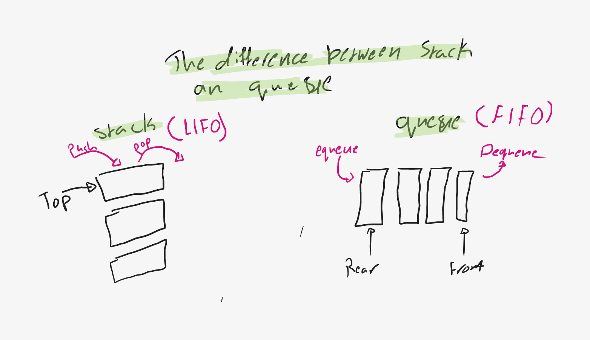

# stack 

- have a top 

- have pop and push methods that responsiplie for pushing to the top or removing the top

- can check it if its empty 

# queue 

- have a front and rear

- have a Equeue method to add to the rear 

- have a dequeue method to remove from front 

- have a peek method inspecting the front value

- can check it if its empty 

### here is a diagram shows the difference between stack and queue

referance 

[stacks and queues](https://codefellows.github.io/common_curriculum/data_structures_and_algorithms/Code_401/class-10/resources/stacks_and_queues.html)