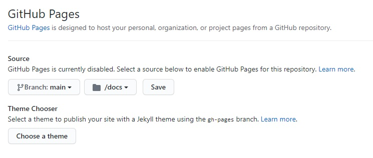

markdown is really interesting language in documenting since it looks good, you can make several text editing with is like making text **bold** *italic* or even `highlighted` 
you can go this using the following symbols :
```
* word *  to make it italic
** word ** to make it bold 
` word ` to make it highlighted 
```
you can use other cool properties , read the [documentation](https://docs.github.com/en/github/writing-on-github/getting-started-with-writing-and-formatting-on-github/basic-writing-and-formatting-syntax#quoting-code) to know how 

you can use this language in documenting readme.md file in GitHub and publish it using GitHub pages section on the setting part 

you can see  GitHub pages bellow and notices it include multiple setting so make your setting done and click save and you will have a publishable website
you can also choose a theme for it to make it better 



